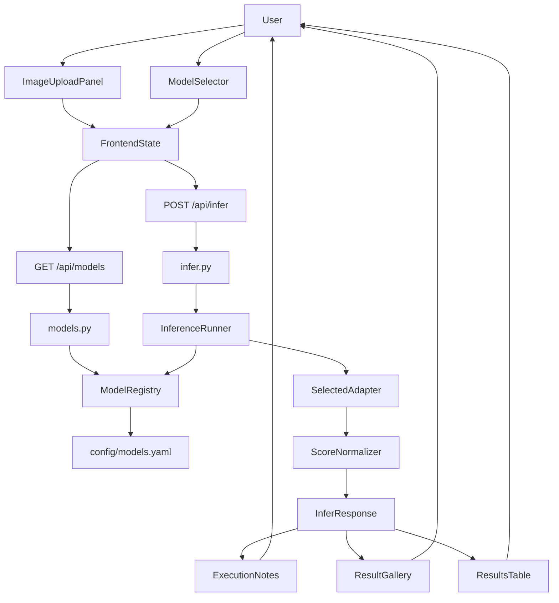
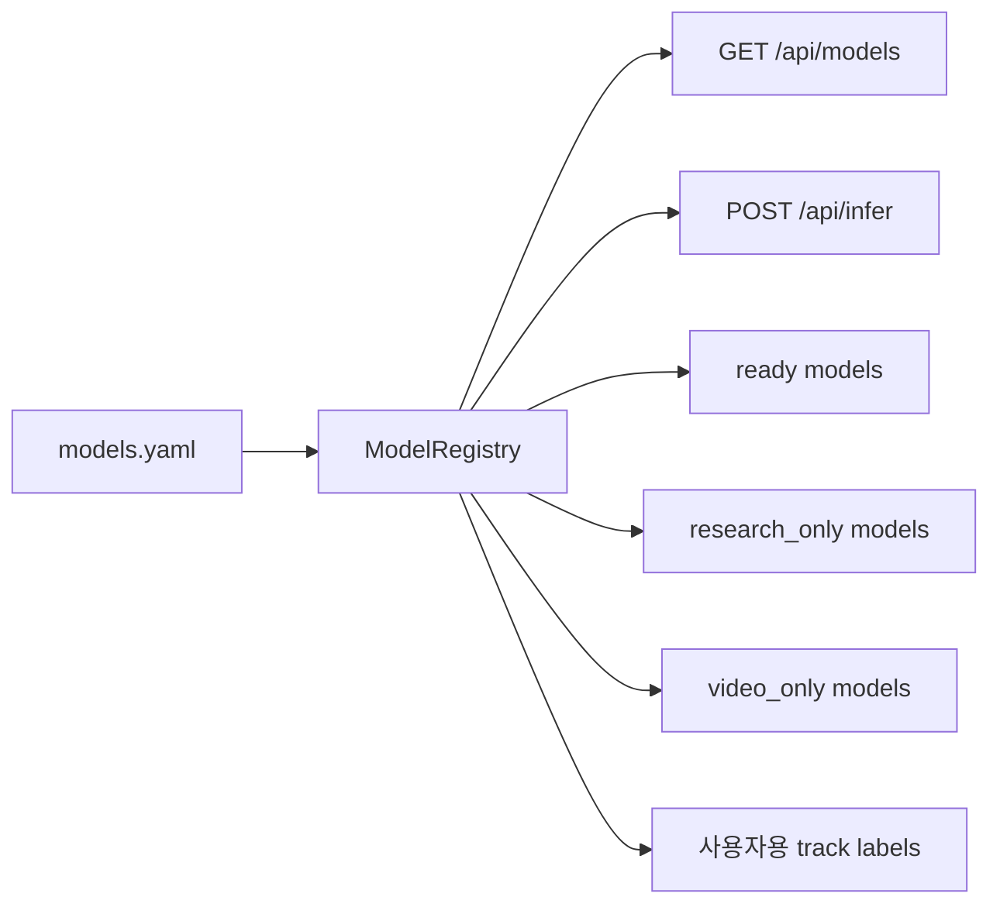
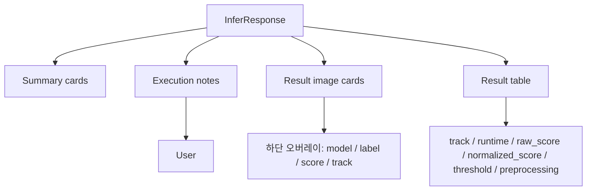
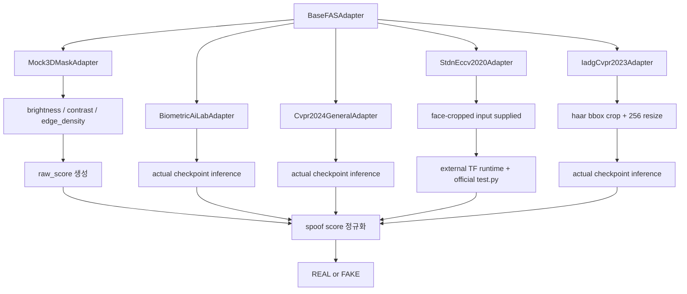
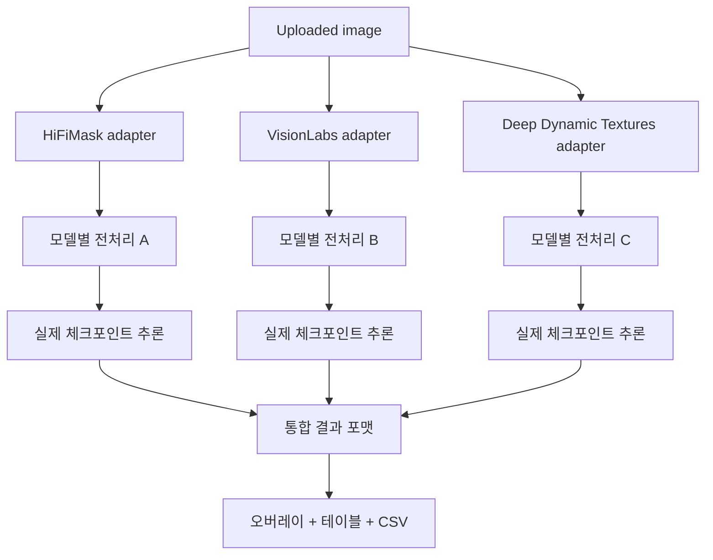

# FAS_APP 모델 흐름도

## 목적
이 문서는 `FAS_APP`에서 모델 메타데이터가 로드되고, 사용자가 모델을 선택하고, 추론 결과가 화면에 표시되기까지의 흐름을 정리합니다.

## 현재 사용자 표기 원칙
- 내부 코드값 `3d_specialized`는 UI에서 `3D 마스크 특화 FAS`로 표시합니다.
- 내부 코드값 `general_physical_digital_fas`는 UI에서 `일반 FAS (물리·디지털 공격)`으로 표시합니다.
- 내부 코드값 `actual`, `mock`, `planned`는 각각 `실제 체크포인트`, `모의 결과`, `미연동`으로 표시합니다.

## 전체 흐름


## 모델 메타데이터 흐름


## 추론 실행 흐름
```mermaid
flowchart TD
    Request[Infer request] --> Resolve["resolve_model_ids()"]
    Resolve -->|"use_all_models=true"| ReadyOnly[ready 모델 전체 선택]
    Resolve -->|"use_all_models=false"| SelectedOnly[사용자 선택 모델 사용]
    ReadyOnly --> Loop[모델별 반복]
    SelectedOnly --> Loop
    Loop --> BuildAdapter[build_adapter]
    BuildAdapter --> Predict[predict(image)]
    Predict --> RawScore[raw_score]
    RawScore --> Normalize[normalize_to_spoof_probability]
    Normalize --> ThresholdCheck{score >= threshold?}
    ThresholdCheck -->|yes| Fake[FAKE]
    ThresholdCheck -->|no| Real[REAL]
    Fake --> Row[결과 row 생성]
    Real --> Row
    Row --> Response[응답 반환]
```

## 프론트 표시 흐름


## 현재 구현 기준 모델 상태
- `ready`
  - 앱에서 선택 가능
  - 현재는 `biometric_lab_transformer`, `cvpr2024_mobilenet_v3_small`, `stdn_eccv2020`, `iadg_cvpr2023` 4개가 실제 체크포인트 연결 완료
- `research_only`
  - 메타데이터만 표시
  - 일부 모델은 실제 adapter 코드가 들어갔더라도 외부 런타임 미설정 상태에서는 `research_only`로 유지
- `video_only`
  - 단일 이미지 기반 UI에서는 실행하지 않음
  - 추후 비디오 모드에서 분리 예정

## 실제 체크포인트 조사 결과
- `biometric_lab_transformer`
  - 실제 파일 확보 완료
  - 로컬에서 실제 추론 smoke test 완료
- `cvpr2024_mobilenet_v3_small`
  - 실제 파일 확보 완료
  - 로컬에서 실제 추론 smoke test 완료
  - 단, `3D 마스크 특화 FAS`가 아니라 `일반 FAS (물리·디지털 공격)`에 속함
- `VisionLabs ChaLearn 2021`
  - README 기준 공개 checkpoint 다운로드 링크 확인
  - 다음 실제 연동 우선 후보
  - 다만 현재 자동 다운로드는 Google Drive 접근 문제로 실패
- `HiFiMask ICCVW 2021 Baseline`
  - 코드 공개 확인
  - 공개 checkpoint는 현재 미확인
- `Deep Dynamic Textures TIFS 2019`
  - 코드 공개 확인
  - Matlab 기반, 공개 checkpoint 미확인
- `STDN ECCV 2020`
  - 저장소 내 TensorFlow checkpoint 포함 확인
  - 현재 앱에는 subprocess 기반 adapter와 실제 smoke test 성공 상태가 반영됨
  - 외부 TensorFlow 호환 런타임을 준비하면 `ready` 상태로 실행 가능
  - 원 논문/공식 코드 기준으로는 `face crop 된 입력`을 기준으로 봐야 하며, 앱도 그 방향으로 맞추는 것이 원칙
  - 현재 앱은 face-cropped input을 임시 공식 폴더 구조에 배치한 뒤 공식 `test.py`를 실행함
- `IADG CVPR 2023`
  - 공개 Google Drive 폴더에서 실제 checkpoint 다운로드 확인
  - 현재 앱에는 `OCI2M` checkpoint 기반 실제 adapter가 반영됨
  - 앱에서는 `opencv haar + margin 0.3` bbox crop 근사 후 `256x256`, `mean/std=0.5` 규칙으로 추론함

## 현재 어댑터 구조


## 실제 모델 연동 후 목표 흐름


## 핵심 설계 포인트
- 모델별 전처리를 강제 통일하지 않습니다.
- 각 모델의 원래 추론 파이프라인을 존중합니다.
- 대신 결과에 전처리 메타데이터를 함께 표시합니다.
- 특히 `STDN`은 원 논문 기준으로 `face crop 된 입력`을 사용해야 하며, 원본 전체 이미지 직접 입력은 공식 재현으로 보지 않습니다.
- `STDN`의 앱 내 `REAL/FAKE`는 공식 `test.py`의 `score.txt`를 읽은 뒤 앱에서 후처리해 보여줍니다.
- score는 `raw_score`와 `normalized_spoof_score`를 함께 보여줍니다.
- `All Models`는 현재 `ready` 상태 모델만 실행합니다.
- 현재 `ready` 중 실제 추론은 `biometric_lab_transformer`, `cvpr2024_mobilenet_v3_small`, `stdn_eccv2020`, `iadg_cvpr2023` 4개이며, 나머지 대표 후보는 연구/연동 대기 상태입니다.
- 현재 `ready`에는 서로 다른 트랙이 함께 있을 수 있으므로 UI에서 트랙 라벨을 분명히 표시합니다.
